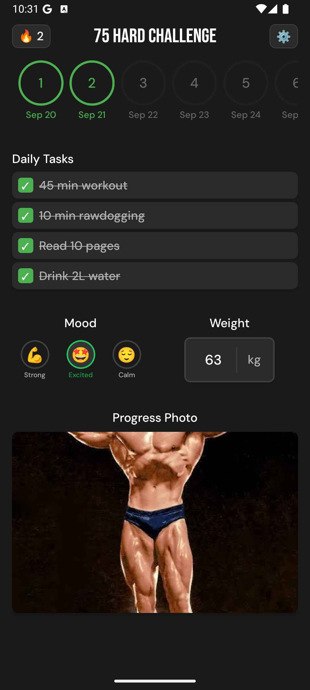

# 💪 75 Hard Habit Tracker

A comprehensive React Native habit tracking app designed to help you complete the 75 Hard challenge. Track your daily tasks, monitor your progress, and stay motivated with mood tracking, photo journaling, and weight monitoring.

## 🛠️ Tech Stack
- **React Native** + **Expo** - Cross-platform mobile development
- **TypeScript** - Type safety and better development experience
- **Expo Router** - File-based navigation system
- **React Native Reanimated** - Smooth animations and gestures
- **Async Storage** - Local data persistence
- **Expo Image Picker** - Photo capture and selection

## 📱 What is it?
The 75 Hard challenge is a mental toughness program that requires you to complete specific daily tasks for 75 consecutive days. This app helps you track your progress, maintain accountability, and build lasting habits. Complete daily tasks, record your mood with 8 different emotions, capture progress photos, monitor your weight, and visualize your consistency with streak tracking.

## 📸 Screenshots

  
  

## 🚀 How to use
1. **Install dependencies**: `npm install`
2. **Start the app**: `npx expo start`
3. **Complete daily tasks** by tapping the checkboxes
4. **Record your mood** by selecting from 8 different emotions
5. **Log your weight** and take progress photos
6. **Track your streak** and overall progress